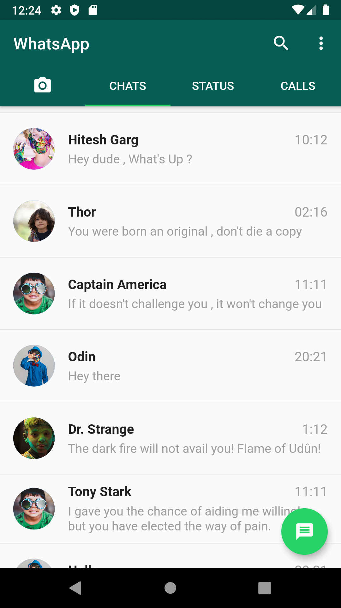
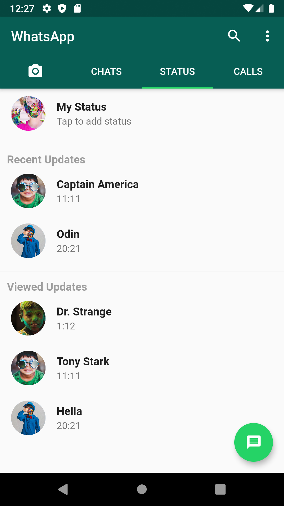
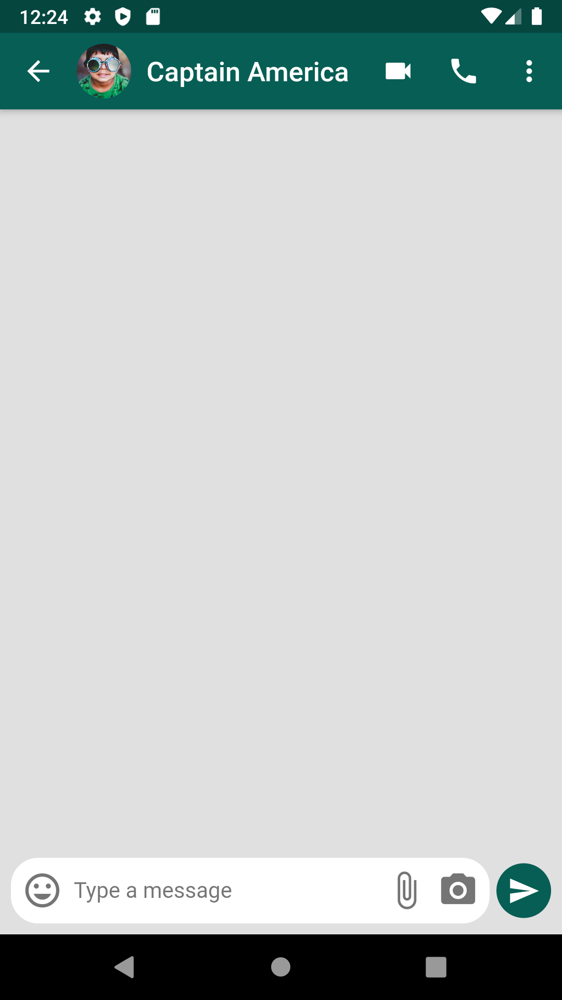

# WhatsaApp Clone - Flutter 💬

WhatsApp UI clone built in flutter.

### Show some :heart: and star the repo to support the project

## Getting Started 🚀

- Clone the repo
- Install the dependicies
- Run it `flutter run`

## Screenshots 📸

|                                           |                                           |                                           |
| ----------------------------------------- | ----------------------------------------- | ----------------------------------------- |
|  |  |  |

## Contact me 📧

#### Email : hiteshgarg285@gmail.com
